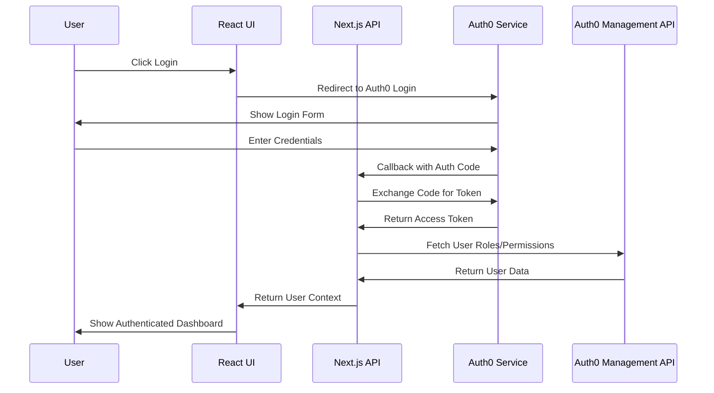
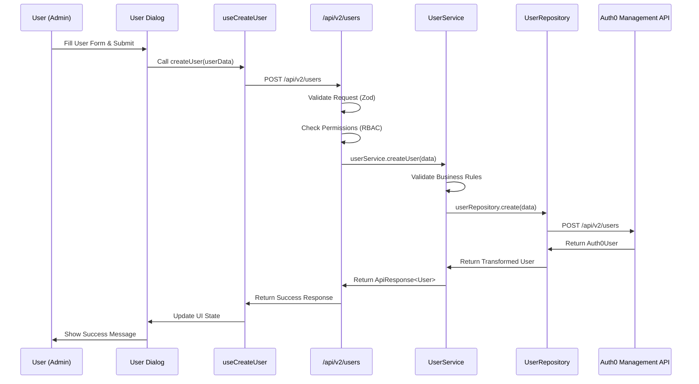
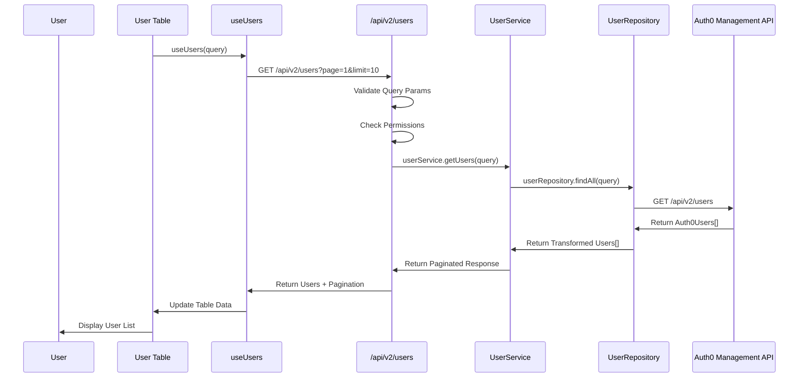

# 🔄 Data Flow & Core Functionality Guide

This document explains the complete data flow and core functionality of the Next.js Auth0 RBAC application, providing a comprehensive understanding of how data moves through the system.

## 🏗️ Architecture Overview

The application follows a **Clean Architecture** pattern with clear separation of concerns across 5 distinct layers:

```
┌─────────────────────────────────────────────────────────────┐
│                    PRESENTATION LAYER                       │
│  ┌─────────────┐  ┌─────────────┐  ┌─────────────────────┐  │
│  │   React     │  │   Custom    │  │   UI Components     │  │
│  │ Components  │  │   Hooks     │  │   (Forms, Tables)   │  │
│  └─────────────┘  └─────────────┘  └─────────────────────┘  │
└─────────────────────────────────────────────────────────────┘
                              │
                              ▼
┌─────────────────────────────────────────────────────────────┐
│                      API LAYER                              │
│  ┌─────────────┐  ┌─────────────┐  ┌─────────────────────┐  │
│  │ Next.js API │  │ Middleware  │  │   Request/Response  │  │
│  │   Routes    │  │ (Auth/RBAC) │  │     Handling        │  │
│  └─────────────┘  └─────────────┘  └─────────────────────┘  │
└─────────────────────────────────────────────────────────────┘
                              │
                              ▼
┌─────────────────────────────────────────────────────────────┐
│                    SERVICE LAYER                            │
│  ┌─────────────┐  ┌─────────────┐  ┌─────────────────────┐  │
│  │User Service │  │Role Service │  │Permission Service   │  │
│  │(Business    │  │(Business    │  │(Business Logic)     │  │
│  │ Logic)      │  │ Logic)      │  │                     │  │
│  └─────────────┘  └─────────────┘  └─────────────────────┘  │
└─────────────────────────────────────────────────────────────┘
                              │
                              ▼
┌─────────────────────────────────────────────────────────────┐
│                   REPOSITORY LAYER                          │
│  ┌─────────────┐  ┌─────────────┐  ┌─────────────────────┐  │
│  │User Repo    │  │Role Repo    │  │Permission Repo      │  │
│  │(Data Access)│  │(Data Access)│  │(Data Access)        │  │
│  └─────────────┘  └─────────────┘  └─────────────────────┘  │
└─────────────────────────────────────────────────────────────┘
                              │
                              ▼
┌─────────────────────────────────────────────────────────────┐
│                 INFRASTRUCTURE LAYER                        │
│  ┌─────────────┐  ┌─────────────┐  ┌─────────────────────┐  │
│  │Auth0 Mgmt   │  │Auth0 Auth   │  │   External APIs     │  │
│  │    API      │  │  Provider   │  │   & Services        │  │
│  └─────────────┘  └─────────────┘  └─────────────────────┘  │
└─────────────────────────────────────────────────────────────┘
```

## 🔄 Complete Data Flow

### 1. Authentication Flow



### 2. User Management Data Flow

#### Creating a User



#### Reading Users



## 🔐 Authentication & Authorization Flow

### 1. User Authentication Process

```typescript
// 1. User clicks login
const login = () => {
  window.location.href = '/auth/login'  // Redirects to Auth0
}

// 2. Auth0 callback processes authentication
// app/auth/callback/route.ts
export async function GET(request: Request) {
  const session = await getServerSession(request)
  // Session contains user data from Auth0
}

// 3. User context is enhanced with roles/permissions
// lib/auth0-provider.tsx
useEffect(() => {
  const fetchUserData = async () => {
    const [rolesResponse, permissionsResponse] = await Promise.all([
      fetch(`/api/users/${auth0User.sub}/roles`),
      fetch(`/api/users/${auth0User.sub}/permissions`)
    ])
    
    setUser({
      ...auth0User,
      roles: roles.roles || [],
      permissions: permissions.permissions || []
    })
  }
}, [auth0User])
```

### 2. Permission Checking Flow

```typescript
// 1. Component checks permission before rendering
<PermissionGate permission="users:create">
  <CreateUserButton />
</PermissionGate>

// 2. PermissionGate component logic
export function PermissionGate({ permission, children }) {
  const { user } = useAuth0()
  const hasAccess = hasPermission(
    user?.role,
    permission,
    user?.customPermissions,
    user?.auth0Permissions
  )
  
  return hasAccess ? children : null
}

// 3. API route protection
export const POST = withPermission('users:create')(async (request) => {
  // Only users with 'users:create' permission can access this
})
```

## 📊 Data Transformation Pipeline

### 1. Auth0 User → Application User

```typescript
// Auth0 User (from Management API)
interface Auth0User {
  user_id: string
  email: string
  name: string
  app_metadata: {
    role: 'admin' | 'sales_senior' | ...
    status: 'active' | 'inactive'
  }
}

// Transformed to Application User
interface User {
  id: string
  email: string
  name: string
  status: UserStatus
  roles: Role[]
  permissions: Permission[]
}
```

### 2. Request Validation Pipeline

```typescript
// 1. API Route receives request
export async function POST(request: NextRequest) {
  // 2. Validate request body with Zod schema
  const userData = validateRequest(createUserSchema, body)
  
  // 3. Service layer validates business rules
  this.validateEmail(userData.email)
  this.validatePassword(userData.password)
  
  // 4. Repository layer handles data access
  const user = await this.userRepository.create(userData)
}
```

## 🎯 Core Functionality Breakdown

### 1. User Management

**Components:**
- `UserTable` - Displays paginated user list
- `UserDialog` - Create/Edit user form
- `DeleteUserDialog` - Confirmation dialog

**Data Flow:**
1. **List Users**: `useUsers()` → API → Service → Repository → Auth0
2. **Create User**: Form → `useCreateUser()` → API → Service → Repository → Auth0
3. **Update User**: Form → `useUpdateUser()` → API → Service → Repository → Auth0
4. **Delete User**: Button → `useDeleteUser()` → API → Service → Repository → Auth0

### 2. Role-Based Access Control (RBAC)

**Permission System:**
```typescript
// Role definitions
const ROLE_PERMISSIONS = {
  admin: ['users:read', 'users:create', 'users:update', 'users:delete', ...],
  sales_senior: ['users:read', 'users:create', 'dashboard:view_all', ...],
  sales_junior: ['users:read', 'dashboard:view_own'],
  // ... other roles
}

// Permission checking
function hasPermission(role, permission, customPermissions?, auth0Permissions?) {
  // 1. Check Auth0 permissions (most authoritative)
  if (auth0Permissions?.length > 0) {
    return auth0Permissions.some(p => p.name === permission)
  }
  
  // 2. Check custom permissions (override role permissions)
  if (customPermissions?.length > 0) {
    return customPermissions.includes(permission)
  }
  
  // 3. Fall back to role-based permissions
  return ROLE_PERMISSIONS[role]?.includes(permission) ?? false
}
```

### 3. Dashboard System

**Role-Based Dashboards:**
- **Admin**: Full access to all data
- **Sales Senior/Junior**: Sales-specific data
- **Marketing Senior/Junior**: Marketing-specific data
- **Client**: Limited personal data

**Data Flow:**
1. User logs in → Role determined → Dashboard component rendered
2. Dashboard fetches data based on user permissions
3. Different widgets/statistics shown per role

## 🔧 Key Technical Patterns

### 1. Repository Pattern
```typescript
// Abstract data access layer
abstract class BaseRepository<T> {
  abstract findAll(params?: Query): Promise<RepositoryResult<T[]>>
  abstract findById(id: string): Promise<T | null>
  abstract create(data: CreateRequest): Promise<T>
  abstract update(id: string, data: UpdateRequest): Promise<T>
  abstract delete(id: string): Promise<void>
}
```

### 2. Service Layer Pattern
```typescript
// Business logic layer
class UserService extends BaseService {
  async createUser(userData: CreateUserRequest): Promise<ApiResponse<User>> {
    // 1. Validate input
    this.validateRequired(userData.email, 'Email')
    this.validateEmail(userData.email)
    
    // 2. Check business rules
    const existingUser = await this.userRepository.findById(userData.email)
    if (existingUser) {
      throw new ConflictError('User already exists')
    }
    
    // 3. Execute operation
    const user = await this.userRepository.create(userData)
    return this.createSuccessResponse(user, 'User created successfully')
  }
}
```

### 3. Custom Hooks Pattern
```typescript
// Reusable data fetching logic
export function useUsers(query?: UserQuery) {
  return usePaginatedApi<User>(
    async (page, limit) => {
      const params = new URLSearchParams({
        page: page.toString(),
        limit: limit.toString(),
        ...(query?.search && { search: query.search })
      })
      
      const response = await fetch(`/api/v2/users?${params}`)
      return await response.json()
    },
    query?.page || 1,
    query?.limit || 10
  )
}
```

## 🚀 API Endpoints Overview

### User Management
- `GET /api/v2/users` - List users with pagination
- `POST /api/v2/users` - Create user or bulk operations
- `GET /api/v2/users/{id}` - Get user by ID
- `PATCH /api/v2/users/{id}` - Update user
- `DELETE /api/v2/users/{id}` - Delete user
- `GET /api/v2/users/stats` - Get user statistics
- `GET /api/v2/users/search` - Search users

### Authentication
- `GET /auth/login` - Initiate login
- `GET /auth/logout` - Logout user
- `GET /auth/callback` - Auth0 callback
- `GET /auth/profile` - Get user profile

## 🔍 Error Handling Flow

```typescript
// 1. Service layer throws specific errors
throw new ValidationError('Email is required')
throw new ConflictError('User already exists')
throw new NotFoundError('User not found')

// 2. API layer catches and transforms errors
catch (error: any) {
  const appError = handleError(error, request.url)
  return NextResponse.json(createErrorResponse(appError), { 
    status: appError.statusCode 
  })
}

// 3. Frontend handles errors gracefully
const { data, error, loading } = useUsers()
if (error) {
  return <ErrorMessage message={error} />
}
```

## 📈 Performance Optimizations

### 1. Data Fetching
- **TanStack Query**: Caching, background refetching, optimistic updates
- **Pagination**: Efficient data loading with page-based pagination
- **Debounced Search**: Prevents excessive API calls during typing

### 2. UI Optimizations
- **React.memo**: Prevents unnecessary re-renders
- **Lazy Loading**: Code splitting for better initial load
- **Optimistic Updates**: Immediate UI feedback for better UX

## 🧪 Testing Strategy

### 1. Unit Tests
- Service layer business logic
- Utility functions and helpers
- Custom hooks

### 2. Integration Tests
- API endpoint testing
- Database operations
- Auth0 integration

### 3. E2E Tests
- Complete user workflows
- Cross-browser compatibility
- Performance testing

## 🔒 Security Considerations

### 1. Authentication
- Auth0 handles secure authentication
- JWT tokens for session management
- Automatic token refresh

### 2. Authorization
- Role-based access control (RBAC)
- Permission-based component rendering
- API endpoint protection

### 3. Data Validation
- Input validation with Zod schemas
- SQL injection prevention (Auth0 handles this)
- XSS protection through React

## 📝 Key Files & Their Roles

| File | Purpose | Layer |
|------|---------|-------|
| `lib/auth0-management.ts` | Auth0 Management API client | Infrastructure |
| `lib/services/user.service.ts` | User business logic | Service |
| `lib/repositories/user.repository.ts` | User data access | Repository |
| `app/api/v2/users/route.ts` | User API endpoints | API |
| `hooks/use-users.ts` | User data fetching hooks | Presentation |
| `components/users/user-table.tsx` | User list component | Presentation |
| `lib/middleware/auth.middleware.ts` | Authentication middleware | API |
| `lib/rbac/permissions.ts` | RBAC permission system | Service |

This architecture ensures maintainable, scalable, and secure user management with clear separation of concerns and comprehensive error handling throughout the entire data flow.
